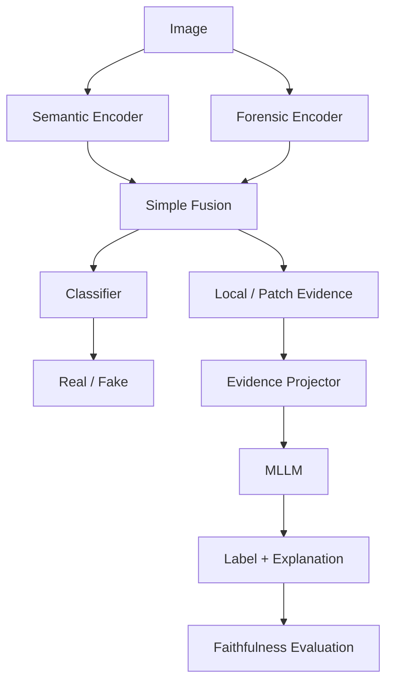

# ForenSight

**ForenSight** là research project về **generalizable và explainable AI-generated image detection**.

Mục tiêu không chỉ là dự đoán `real/fake`, mà còn kiểm tra xem hệ thống có:

1. học được forensic evidence đủ tốt để generalize sang generator chưa thấy;
2. truyền được evidence đó vào MLLM thay vì chỉ truyền nhãn;
3. sinh explanation thực sự phụ thuộc vào evidence mà model sử dụng.

## Research questions

- **RQ1 — Perception:** Semantic + forensic representation có giúp generalization tốt hơn từng nhánh riêng không?
- **RQ2 — Alignment:** Forensic evidence có được truyền qua projector vào MLLM hay projector chỉ mã hóa quyết định `real/fake`?
- **RQ3 — Faithfulness:** Explanation của MLLM có thay đổi đúng khi forensic evidence bị thay đổi hoặc loại bỏ không?

Chi tiết: [docs/research-problem.md](docs/research-problem.md)

## Kiến trúc nghiên cứu

Nguyên tắc chính:

> **Simple baseline first → chứng minh failure → chỉ tăng complexity để giải quyết failure đã quan sát được.**

Kiến trúc chi tiết: [docs/architecture.md](docs/architecture.md)

## Roadmap

| Milestone | Mục tiêu | Trạng thái |
| --- | --- | --- |
| R0 | Dataset + Evaluation Protocol | **ACTIVE** |
| R1 | Base MLLM Baseline | Planned |
| R2 | Stage 1: Semantic / Forensic / Fusion | Planned |
| R3 | Candidate Evidence Extraction | Planned |
| R4 | Stage 2A: Label-only Alignment | Planned |
| R5 | Stage 2B: Evidence-aware Alignment | Planned |
| R6 | Evidence Causality Diagnostics | Planned |
| R7 | Stage 3: Explanation LoRA | Planned |
| R8 | Explanation Faithfulness | Planned |
| R9 | Full Evaluation | Planned |

Roadmap chi tiết: [docs/roadmap.md](docs/roadmap.md)

## Tài liệu chuẩn

- [Research Problem](docs/research-problem.md)
- [Architecture](docs/architecture.md)
- [Evaluation Protocol](docs/evaluation-protocol.md)
- [Roadmap](docs/roadmap.md)
- [R0 Plan](docs/plans/r0-dataset-evaluation.md)
- [Literature Notes](docs/literature-notes.md)
- [Decision Log](docs/decisions/README.md)

## Quy tắc phát triển

Project này ưu tiên **học tập, research quality và code dễ hiểu**.

- PyTorch thuần trước khi cân nhắc framework cao hơn.
- Không thêm abstraction khi chưa có nhu cầu thực tế.
- Không thêm module chỉ vì paper khác dùng.
- Mỗi thay đổi code phải trả lời được: **đang kiểm tra research question nào?**
- Mỗi milestone phải có success/failure criteria trước khi chạy experiment.

Coding agents phải đọc [AGENTS.md](AGENTS.md) trước khi implement.
