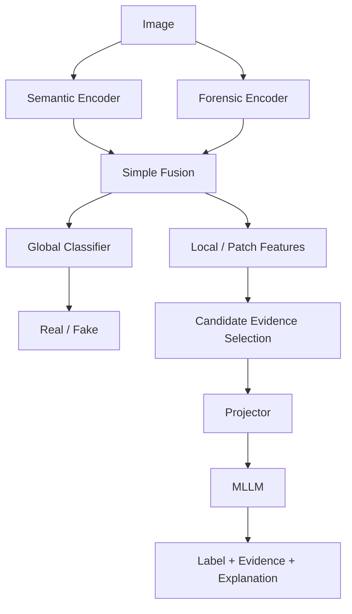

# Architecture

## 1. Nguyên tắc thiết kế

Kiến trúc phải tối thiểu đủ để kiểm tra research questions.

> **Simple baseline first → observed failure → hypothesis → minimal architecture change.**

Không coi độ phức tạp là contribution.

## 2. Kiến trúc tổng quát



`Candidate Evidence Selection` ban đầu là diagnostic đơn giản, không phải một neural subsystem phức tạp.

## 3. Stage 1 — Forensic Perception

### Input

Image.

### Semantic branch

Ban đầu dùng một pretrained visual encoder phù hợp experiment.

Mục tiêu: giữ representation semantic/general visual.

### Forensic branch

Ban đầu dùng một forensic encoder đơn giản, ưu tiên implementation dễ đọc.

Mục tiêu: học low-level signal ít phụ thuộc semantic hơn.

### Fusion baseline

Bắt đầu bằng:

```text
semantic feature ──┐
                   ├── concat -> MLP -> classifier
forensic feature ──┘
```

Không dùng attention/gating phức tạp trước khi concat baseline thất bại có ý nghĩa.

### Required ablation

- semantic-only;
- forensic-only;
- concat fusion.

### Outputs cần giữ

- global feature;
- classification logits/probability;
- patch/local features trước khi pooling nếu backbone cho phép.

## 4. Candidate Evidence Extraction

Version đầu không tạo evidence network riêng.

Mỗi candidate evidence cần tối thiểu:

```text
feature + location + contribution score
```

Ví dụ conceptual:

```json
{
  "patch_id": 17,
  "x": 128,
  "y": 96,
  "score": 0.82
}
```

### Baseline operational definition

Một patch chỉ được xem là **candidate evidence** khi nó có contribution score cao theo một attribution/contribution rule được cố định trước experiment.

Baseline ưu tiên đơn giản và dễ hiểu:

```text
contribution(patch)
=
P(original class | original representation)
-
P(original class | representation with that patch removed/replaced)
```

Trong implementation đầu tiên có thể dùng removal/replacement ở feature level để tránh tạo pixel artifact không cần thiết.

Top-k chỉ là ranking của candidate evidence. Nó chưa chứng minh patch đó là forensic evidence đúng.

### Validation ở R6

Candidate evidence chỉ được nâng thành **validated predictive evidence** nếu intervention cho thấy:

- remove/replace high-score evidence gây thay đổi prediction lớn hơn matched low-score control;
- kết quả lặp lại ở dataset level;
- thay đổi không chỉ xuất hiện ở vài qualitative example.

## 5. Stage 2 — Evidence Alignment

Projector ánh xạ visual/forensic representation sang hidden embedding mà MLLM có thể tiếp nhận.

Không mô tả projector là "biến classifier embedding thành vocabulary token".

### Stage 2A — Label-only baseline

```text
Stage 1 representation
        ↓
small MLP projector
        ↓
frozen MLLM
        ↓
real / fake
```

Mục tiêu: kiểm tra representational compatibility cơ bản.

### Stage 2B — Evidence-aware alignment

Stage 2 phải giữ thêm thông tin evidence, ví dụ:

- local candidate-evidence tokens;
- location;
- evidence category nếu dataset/supervision hỗ trợ.

Stage 2B chỉ được thiết kế sau khi Stage 2A chạy ổn và failure/gap đã đo được.

## 6. Stage 3 — Explanation Reasoning

Baseline:

```text
Stage 1 frozen
Stage 2 frozen
MLLM + LoRA
```

Sau đó mới ablate:

- Stage 2 frozen;
- Stage 2 low learning rate;
- Stage 2 trainable.

Không full fine-tune MLLM trước khi LoRA baseline được hiểu rõ.

## 7. Complexity budget

Mặc định không thêm:

- Q-Former;
- Perceiver Resampler;
- cross-attention fusion;
- teacher-student subsystem;
- frequency branch;
- reconstruction branch;
- DPO/RLHF;
- custom training framework.

Một module mới chỉ hợp lệ khi có experiment chỉ ra gap cụ thể và module đó kiểm tra hypothesis rõ ràng.
