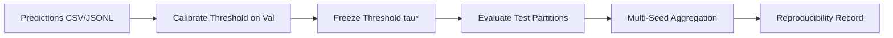

# Evaluation Protocol & Benchmark Standards

## 1. Overview & Evaluation Flow

ForenSight establishes a model-agnostic, leak-free evaluation protocol for binary AI-generated image detection.
The evaluation engine consumes prediction records (`sample_id`, `label`, `score`, and partition metadata) rather than PyTorch models directly, allowing consistent benchmarking across CNNs, Vision Transformers, frequency-based models, and multimodal LLMs.

### The Evaluation Lifecycle



---

## 2. Threshold Policy & Test-Invariance Guarantee

### The Core Invariant
> **Threshold Rule:** The decision threshold $\tau^*$ **MUST** be selected exclusively from the validation partition (`val`) and frozen prior to evaluating test distributions.
> **Under NO circumstances is a threshold tuned, searched, or swept on test data.**

Optimizing thresholds on test data introduces data snooping, inflates reported metrics, and invalidates scientific comparisons across baselines.

### Threshold Selection Strategies
The function `select_threshold(y_true, y_scores, strategy=...)` supports three optimization criteria:

| Strategy | Objective | Formula | Recommended Use |
|---|---|---|---|
| `"f1"` | Maximize F1-Score | $\arg\max_\tau F_1(\tau)$ | Imbalanced datasets, prioritizing fake detection precision & recall. |
| `"accuracy"` | Maximize Accuracy | $\arg\max_\tau \frac{\text{TP}(\tau) + \text{TN}(\tau)}{N}$ | Balanced validation sets, equal penalty for false alarms and misses. |
| `"youden"` | Maximize Youden's J | $\arg\max_\tau [\text{TPR}(\tau) - \text{FPR}(\tau)]$ | Diagnostic sensitivity-specificity balance independent of prior prevalence. |

- **Candidate Search:** Thresholds are selected from observed score midpoints in $\mathcal{O}(N \log N)$ time.
- **Tie-Breaking:** When multiple candidate thresholds achieve the identical maximum score, tie-breaking chooses the threshold closest to $0.5$ (maximizing margin).
- **Threshold Provenance:** Every evaluation report explicitly records the numerical threshold and its source string (e.g. `"val_optimal_f1"`, `"default_0.5"`).

---

## 3. Detection Metrics Hierarchy

### 3.1 Primary Metric: AUROC
- **Area Under the ROC Curve (AUROC)** is ForenSight's primary metric for detection and generalization.
- **Properties:** Threshold-free, invariant to class imbalance, and reflects the probability that a random fake sample scores higher than a random real sample.
- **Single-class partitions:** If a slice contains only real or only fake images, AUROC is mathematically undefined and reports as `None` (`"N/A"` in tables).

### 3.2 Secondary Metrics (at frozen $\tau^*$)
- **Accuracy:** $(\text{TP} + \text{TN}) / N$
- **F1-Score:** $2 \cdot \text{TP} / (2 \cdot \text{TP} + \text{FP} + \text{FN})$
- **Precision:** $\text{TP} / (\text{TP} + \text{FP})$
- **Recall (Sensitivity / TPR):** $\text{TP} / (\text{TP} + \text{FN})$

---

## 4. Evaluation Slices & Breakdowns

Every evaluation run computes overall benchmark performance and multi-slice breakdowns:

1. **Overall Benchmark:** Aggregated strictly across evaluation and test partitions (`in_domain_test`, `cross_generator_ood`, `modern_external`). Training and validation partitions are **strictly excluded** from overall metrics.
2. **Breakdown by Split:** Performance on individual partitions (`val`, `in_domain_test`, `cross_generator_ood`, `modern_external`).
3. **Breakdown by Generator Architecture:** Performance grouped by generative model (`sd15`, `midjourney`, `adm`, `glide`, `wukong`, `vqdm`, `biggan`, `flux`).
4. **Breakdown by Dataset Source:** Performance grouped by source dataset (`genimage`, `genimage_plus_plus`).

---

## 5. Repeated Runs & Uncertainty Quantification

### 5.1 The 3-Seed Invariant
Due to stochastic training dynamics (weight initialization, batch shuffling, data augmentations), primary baselines must be evaluated across at least **3 distinct random seeds** ($N \ge 3$) when compute permits.

### 5.2 Baseline Sealing vs. Preliminary Status

| Status | Criterion | Permitted Scientific Claims | Schema Flag |
|---|---|---|---|
| **Preliminary Result** | $N < 3$ runs (1 or 2 seeds) | Exploratory iterations, debugging, sanity checks. **Forbidden:** claiming a method is "better" or "superior" based on small gains. | `is_preliminary: True` |
| **Sealed Baseline** | $N \ge 3$ runs across distinct seeds | Official benchmark claims, paper tables, formal comparative analysis. | `is_preliminary: False` |

### 5.3 Uncertainty Reporting: $\text{mean} \pm \text{std}$
- Uncertainty is reported as sample standard deviation with Bessel's correction (`ddof=1` for $N \ge 2$, $0.0$ for $N = 1$):
  $$s = \sqrt{\frac{1}{N - 1} \sum_{i=1}^N (m_i - \bar{m})^2}$$
- Formatted output: `0.8950 ± 0.0120`.

---

## 6. Experiment Reproducibility Record

Every evaluation run must record and optionally export a machine-readable `ReproducibilityRecord`:

| Field | Type | Description |
|---|---|---|
| `run_id` | `str` | Unique execution identifier |
| `experiment_name` | `str` | Logical baseline family |
| `timestamp` | `str` | UTC ISO 8601 timestamp |
| `git_commit` | `str \| None` | Git commit SHA (`HEAD`) at runtime |
| `seed` | `int \| str \| None` | Random seed for the run |
| `split_version` | `str` | Dataset manifest version tag (e.g. `r0-smoke`, `genimage_v1.0`) |
| `config` | `dict` | Hyperparameters and run configuration |
| `threshold_source` | `str` | Strategy used to calibrate threshold (e.g. `val_optimal_f1`) |
| `threshold_value` | `float` | Numerical threshold $\tau^*$ calibrated on validation data |
| `metrics` | `dict` | Computed metrics (overall and slice breakdowns) |
| `environment` | `dict` | OS platform, Python version, dependencies, hardware |
| `notes` | `str` | Annotations or operational context |

---

## 7. Allowed Scientific Claims

To preserve research integrity, avoid using the following terms unless supported by protocol evidence:
- Do **not** claim `generalizable` if evaluated only in-domain.
- Do **not** claim `faithful` based solely on LLM-as-judge or human fluency scores.
- Do **not** claim `evidence-preserving` based only on label accuracy.
- Do **not** claim `better` if the improvement falls within random run-to-run variance (1–3% AUROC) or protocol baselines are not strictly equivalent.

---

## 8. CLI Runner Commands

```bash
# 1. Run single evaluation with validation threshold calibration
python scripts/run_evaluation.py \
    --predictions data/preds/baseline_seed42.jsonl \
    --val-split val \
    --threshold-strategy f1 \
    --seed 42 \
    --output-json results/seed42_report.json \
    --output-md results/seed42_report.md

# 2. Aggregate repeated runs across multiple seeds
python scripts/aggregate_runs.py \
    --reports results/seed42_report.json results/seed43_report.json results/seed44_report.json \
    --output-json results/aggregated_report.json \
    --output-md results/aggregated_report.md
```
