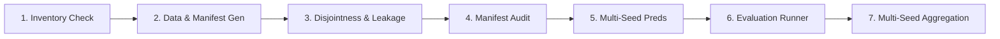

# Smoke-Test Protocol & Fast Sanity Pipeline

## 1. Overview & Purpose

ForenSight is a research project exploring generalizable and explainable AI-generated image detection. The Stage 1 dataset strategy involves large benchmark corpuses (e.g. GenImage with >360,000 images, GenImage++, WildRF, Chameleon) spanning tens of gigabytes.

Downloading, decompressing, and scanning raw benchmark datasets during local development or in automated CI/CD environments is compute- and bandwidth-prohibitive. Furthermore, coding agents require immediate, deterministic feedback loops to verify that modifications to split policies, data structures, evaluation runners, or audit metrics maintain end-to-end pipeline integrity.

**Task 0.7** provides a self-contained, lightweight smoke-testing suite that:
1. Synthesizes a valid miniature GenImage folder hierarchy with Pillow in milliseconds without external data dependencies;
2. Builds deterministic manifest files mirroring Protocol v1 split specifications;
3. Executes the entire ForenSight R0 evaluation lifecycle end-to-end in `< 1` second:
   - Inventory verification (`load_inventory`);
   - Dataset generation and serialization;
   - Leakage and generator-disjointness assertions (`assert_generator_disjoint`, `validate_no_leakage`);
   - Dataset forensic auditing (`audit_manifest_images`, `audit_manifest_leakage`);
   - Multi-seed synthetic model prediction simulation ($N = 3$ seeds);
   - Model-agnostic evaluation runner with validation threshold calibration (`evaluate_predictions`);
   - Repeated-run multi-seed aggregation and uncertainty quantification (`aggregate_reports`).

> [!IMPORTANT]
> Smoke-test datasets and pipelines are strictly development aids and CI/CD sanity checks. In accordance with [`AGENTS.md`](../AGENTS.md) and [`docs/research-problem.md`](research-problem.md), smoke-test results **must never** be cited as primary research evidence or used for scientific conclusions.

---

## 2. Synthetic Dataset Layout

Synthetic images are generated deterministically using Pillow as valid JPEG files containing standard ITU-T T.81 luminance quantization tables. The directory hierarchy precisely mirrors the canonical GenImage structure:

```text
<output_dir>/
├── genimage/
│   ├── sdv4/
│   │   ├── train/
│   │   │   ├── nature/<synset_id>/real_<synset_id>.jpg   (Real: ImageNet photos, label=0, generator='nature')
│   │   │   └── ai/<synset_id>/fake_<synset_id>.jpg       (Fake: SD1.4 generated, label=1, generator='sd14')
│   │   └── val/
│   │       ├── nature/<synset_id>/real_<synset_id>.jpg   (Real: In-domain val, label=0, generator='nature')
│   │       └── ai/<synset_id>/fake_<synset_id>.jpg       (Fake: In-domain SD1.4 val, label=1, generator='sd14')
│   ├── sdv5/
│   │   └── val/
│   │       ├── nature/<synset_id>/real_<synset_id>.jpg   (Real: Near-OOD val, label=0, generator='nature')
│   │       └── ai/<synset_id>/fake_<synset_id>.jpg       (Fake: SD1.5 near-OOD val, label=1, generator='sd15')
│   └── midjourney/
│       └── val/
│           ├── nature/<synset_id>/real_<synset_id>.jpg   (Real: Cross-gen val, label=0, generator='nature')
│           └── ai/<synset_id>/fake_<synset_id>.jpg       (Fake: Midjourney cross-gen, label=1, generator='midjourney')
└── manifests/
    ├── train.jsonl                                      (In-domain train split manifest)
    ├── val.jsonl                                        (In-domain validation split manifest)
    ├── near_ood.jsonl                                   (SD1.5 near-OOD split manifest)
    └── cross_generator_ood.jsonl                        (Midjourney cross-generator OOD manifest)
```

### Manifest Specifications & Scaling
- **Default Classes:** 5 ImageNet synsets (`n01440764`, `n01443537`, `n01484850`, `n01491361`, `n01494475`).
- **Samples per Split:** 1 real + 1 fake image per class ($2 \times 5 = 10$ samples per split, total 40 images).
- **Scale Tier Invariant:** Adheres to the `smoke` scale tier defined in [`docs/split-policy.md`](split-policy.md) ($\le 1$ real + $\le 1$ fake per ImageNet class).

---

## 3. End-to-End Pipeline Stages

The smoke pipeline (`run_smoke_pipeline()`) executes 7 distinct stages, asserting full contract compliance at each boundary:



### Stage 1: Inventory Verification
- Invokes `load_inventory()` on `data/dataset_inventory.json` (falling back to `build_default_inventory()`).
- Asserts zero schema violations via `inventory.validate(strict=False)`.

### Stage 2: Smoke Dataset & Manifest Generation
- Generates 40 synthetic JPEG images via `generate_smoke_dataset()`.
- Generates corresponding `ManifestRecord` items and persists JSONL files under `<output_dir>/manifests/`.

### Stage 3: Disjointness & Leakage Assertions
- Calls `assert_generator_disjoint(train_manifest, [near_ood, cross_generator_ood])` to guarantee cross-generator independence.
- Calls `validate_no_leakage()` across all train/eval pairs, asserting zero sample ID, image path, or generator collisions.

### Stage 4: Dataset Audit Execution
- Runs `audit_manifest_leakage()` across splits, confirming zero leakage.
- Runs `audit_manifest_images()` on the training partition to inspect physical image attributes, quantization tables, SHA256 hashes, and perceptual dHashes.
- Saves audit JSON and Markdown reports to `<output_dir>/audit/`.

### Stage 5: Synthetic Prediction Simulation
- Simulates detector predictions across 3 distinct seeds (`[seed, seed+1, seed+2]`).
- Generates scores for `val`, `near_ood`, and `cross_generator_ood` partitions using realistic stochastic scoring ($0.85 \pm 0.08$ for fakes, $0.15 \pm 0.08$ for reals).

### Stage 6: Evaluation Runner & Threshold Calibration
- Evaluates each seed's predictions using `evaluate_predictions()`.
- Enforces protocol threshold calibration strictly on the `val` partition, freezing the optimal threshold $\tau^*$ for test partitions.
- Saves individual run reports to `<output_dir>/evaluation/report_seed_<seed>.json`.

### Stage 7: Multi-Seed Repeated Run Aggregation
- Combines the 3 runs using `aggregate_reports()`.
- Confirms the resulting benchmark is a sealed baseline (`is_preliminary: False`).
- Computes mean and sample standard deviation (`ddof=1`) for AUROC, Accuracy, F1, Balanced Accuracy, and ECE.
- Saves aggregated JSON and Markdown reports to `<output_dir>/evaluation/`.

---

## 4. CLI Usage & Options

The command-line runner is located at `scripts/run_smoke_test.py`:

```bash
# Basic run: executes in a temporary directory and cleans up automatically
python scripts/run_smoke_test.py

# Persist artifacts to default path (data/derived/smoke_test)
python scripts/run_smoke_test.py --keep-artifacts

# Custom output directory
python scripts/run_smoke_test.py --output-dir /tmp/smoke_run --keep-artifacts

# Custom class count and random seed
python scripts/run_smoke_test.py --num-classes 10 --seed 123 --keep-artifacts

# Machine-readable JSON output (for programmatic CI/CD consumption)
python scripts/run_smoke_test.py --json
```

### CLI Arguments Reference

| Flag | Short | Default | Description |
|:---|:---:|:---|:---|
| `--output-dir` | `-o` | `None` | Output directory for images, manifests, and reports. If set, artifacts are persisted. |
| `--keep-artifacts` | `-k` | `False` | Preserves generated artifacts on disk (defaults to `data/derived/smoke_test` if `--output-dir` is omitted). |
| `--num-classes` | `-c` | `5` | Number of ImageNet synsets to generate per split. |
| `--seed` | `-s` | `42` | Base random seed for data synthesis, auditing, and repeated evaluations. |
| `--quiet` | `-q` | `False` | Suppresses human-readable progress printing. |
| `--json` | | `False` | Emits complete execution dictionary as formatted JSON to `stdout`. |

---

## 5. Verification Expectations & Runtime

| Property | Expectation |
|:---|:---|
| **Runtime** | `< 0.2` seconds on modern hardware |
| **Exit Code** | `0` on success, `1` on any failure |
| **Image Integrity** | 100% readable JPEG images with valid quantization tables |
| **Leakage Findings** | 0 sample collisions, 0 generator overlaps |
| **Seeded Baseline** | $N = 3$ seeds $\implies$ `is_preliminary: False` |
| **Overall AUROC** | Defined and computed without NaN values |

---

## 6. Integration with Agent Workflow

Per [`AGENTS.md`](../AGENTS.md), before submitting PRs or claiming completion of data or evaluation tasks, agents should run:

```bash
# 1. Canonical unit test suite
python3 -m pytest

# 2. End-to-end smoke test pipeline
python3 scripts/run_smoke_test.py
```
